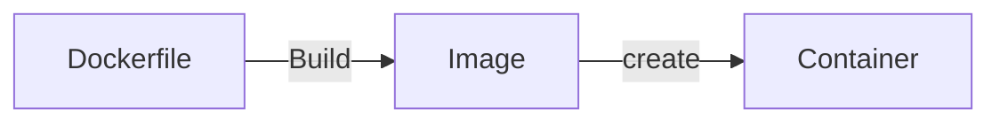

# Docker
## The Problem
- The eternal problem in deploying software is getting setting up the environment to run the application
  - **It works on my machine** problem
- To run an application several things have to be configured and working correctly
  - Runtime Environment to run the application
    - Java JRE
    - Python Interpreter
  - The application maybe needs to run on a specific OS
  - Certain environment variables might need to be set up
  - Certain files and file paths need to be set up
- To run this on app on another machine you would have to manually set all of that up.
## Solutions
- PaaS
  - Elastic beanstalk
  - Is very fast but you lose a lot of customizability
  - There is a strict template to follow
  - **Vendor lock-in** where you tied closesly to a specifc cloud service or provider
  - lose portability
- ***Containerization***
  - Creating *portable* virtual enironments for your application to run in
  - Cargo containers are an insulated environment used to ship around the world

## Docker
- **Containerization Software**
- Key terms
  - **Dockerfile**
    - A script that generates an image
  - **Image**
    - Blueprint for a container
    - An image is like a class
  - **Container**
    - An instance of that image
    - A container is like an object of class
- Dockerhub
  - An online repository of images
  - As GitHub is to source code Dockerhub is to images
### Docker lifecycle

## Containers vs VMs
- Containers are NOT virtual machines
- Containers
  - Small lightweight
  - Very fast to spin up
  - Like another process/application running on a machine
    - No different than have word open or a video game running 
  - Containers DO NOT have their own OS
    - They must piggyback of the one supplied the machine they are on
- Virutal Machine
  - Larger and more independent
  - They their own resources like RAM and CPUs
  - They have an OS


## Container Orchestration
- Containers are portable, easy to manage and easy to create
  - Containers are like a brick for building large software ecosystems
  - Bank of America probably has 100's of different web apps that is uses
- How can I manage these containers to ensure reliability?
  - Automatically scale containers to meet demands
  - Kill and remove containers that failed health checks/ stopped working
  - Create new containers to replace ones that broke down
- *Docker Swarm*
  - Docker supplied container orchestration software
  - docker-compose.yaml
- **Kubernetes**
  - Google software for container orchestration
  - It is open source and free to use/edit
  - More popular
  - Heavy duty container orchestration.
    - Has just about every feature you could image
      - Loadbalancing between containers
      - environment secrets
      - service accounts
      - automatic scaling
      - etc....
  - *kubernetes is hard*

- **infrastructure as code**
  - The deployment of an application can also be source code
  - easily version edit, and automate your deployment infrastrucute

## Docker commands
```bash
# Command to build an image from a dockerfile in the directory
# Tag it -t with a name we can remember
docker build . -t helloapp

# Create a container and run it on local port 7777
# the 5000 is the exposed port the application actually runs on
# docker allows you to map the port to whatever you want
docker run -p 7777:5000 helloapp

# show all containers on the computer
docker ps

# see all the printouts from a container
docker logs containerid

# end a running container
docker kill containerid

# remove conainer
docker rm containerid

# get an image from dockerhub
docker pull imagename
```
