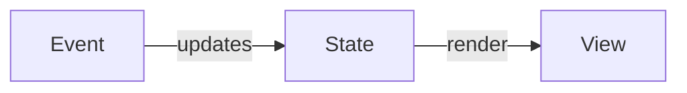

# React
- Front-end library developed by Facebook
  - Very open-ended and customizable

### React Philosphy
- ***Component Based***
  - A logical chunk of html/css/js for a portion of a web page
  - designed to be reuseable
  - Components can be nested
  - **Functional Components**
    - Newer Component style
    - Replaced class based components
    - return JSX
    - Take in props as parameters to the function
- ***JSX***
  - JavaScript eXtenstion
  - HTML/CSS/JS are so intrinsically linked to each other on a web page that they **SHOULD** meld together
  - JSX is a extension of JavaScript that allows you to write HTML looking elements into your JS
  - Your entire React appliation is 99% JavaScript

### Component Lifecycle
1. intialization
   1. Component is created an rendered for the first time
2. Update
   1. Component is rerendered/update if necessary
3. Destruction
   1. Component is removed from the DOM/screen

### Hooks
- Special functions that 'hook' into one of the lifecycle stages
- All hooks start with use by conventions

### useState
- creates a stateful value a for a component
  - A value that might change
  - That change would require the component to re-render
- useState()
  - returns an array 
    - 1st value readonly stateful variable
    - 2nd value setter function to **replace** that variable
- Tips
  - Never edit/change the readonly variable
  - setterFunction **Always** requires a new object
  - Never pass in the stateful variable to the setter function

