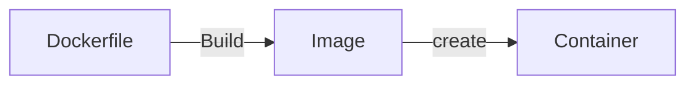
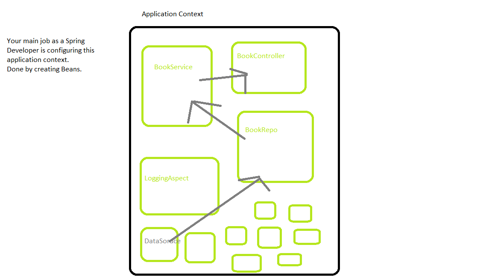

# Week 5 Review

# Docker

## The Problem
- The eternal problem in deploying software is getting setting up the environment to run the application
  - **It works on my machine** problem
- To run an application several things have to be configured and working correctly
  - Runtime Environment to run the application
    - Java JRE
    - Python Interpreter
  - The application maybe needs to run on a specific OS
  - Certain environment variables might need to be set up
  - Certain files and file paths need to be set up
- To run this on app on another machine you would have to manually set all of that up.
## Solutions
- PaaS
  - Elastic beanstalk
  - Is very fast but you lose a lot of customizability
  - There is a strict template to follow
  - **Vendor lock-in** where you tied closesly to a specifc cloud service or provider
  - lose portability
- ***Containerization***
  - Creating *portable* virtual enironments for your application to run in
  - Cargo containers are an insulated environment used to ship around the world

## Docker
- **Containerization Software**
- Key terms
  - **Dockerfile**
    - A script that generates an image
  - **Image**
    - Blueprint for a container
    - An image is like a class
  - **Container**
    - An instance of that image
    - A container is like an object of class
- Dockerhub
  - An online repository of images
  - As GitHub is to source code Dockerhub is to images
### Docker lifecycle

## Containers vs VMs
- Containers are NOT virtual machines
- Containers
  - Small lightweight
  - Very fast to spin up
  - Like another process/application running on a machine
    - No different than have word open or a video game running 
  - Containers DO NOT have their own OS
    - They must piggyback of the one supplied the machine they are on
- Virutal Machine
  - Larger and more independent
  - They their own resources like RAM and CPUs
  - They have an OS


## Container Orchestration
- Containers are portable, easy to manage and easy to create
  - Containers are like a brick for building large software ecosystems
  - Bank of America probably has 100's of different web apps that is uses
- How can I manage these containers to ensure reliability?
  - Automatically scale containers to meet demands
  - Kill and remove containers that failed health checks/ stopped working
  - Create new containers to replace ones that broke down
- *Docker Swarm*
  - Docker supplied container orchestration software
  - docker-compose.yaml
- **Kubernetes**
  - Google software for container orchestration
  - It is open source and free to use/edit
  - More popular
  - Heavy duty container orchestration.
    - Has just about every feature you could image
      - Loadbalancing between containers
      - environment secrets
      - service accounts
      - automatic scaling
      - etc....
  - *kubernetes is hard*

- **infrastructure as code**
  - The deployment of an application can also be source code
  - easily version edit, and automate your deployment infrastrucute

## Docker commands
```bash
# Command to build an image from a dockerfile in the directory
# Tag it -t with a name we can remember
docker build . -t helloapp

# Create a container and run it on local port 7777
# the 5000 is the exposed port the application actually runs on
# docker allows you to map the port to whatever you want
docker run -p 7777:5000 helloapp

# show all containers on the computer
docker ps

# see all the printouts from a container
docker logs containerid

# end a running container
docker kill containerid

# remove conainer
docker rm containerid

# get an image from dockerhub
docker pull imagename
```
# Spring
- A lightwight *framework* for building Java applications
- **Framework**
  - **IoC Inversion of Control**
    - Your code does NOT use another person's code
    - Your code is used *by* the framework/software
    - You are creating a *spring application*
      - You must abide by their rules
      - You must abude by their patterns
      - Failure to do will prevent the application from working at all

## Important Terminology
- **Application Context**
  - A big container that the Spring framework will manage
- **Bean**
  - Any object/class that will be managed in the application context
  - As a Spring developer your job is to create and configure these beans
- **Dependency Injection**
  - Programming design pattern where one object will be *composed/injected* with other objects
  - A bean will often be injected with other beans
- As you work on larger projects it is unrealistic to know what most of the application code looks like.
- Having configured beans will make it easier for you to set up and run the application
- **Decoupling**
  - Removing harcoded values and dependenies within the code
  - Configurable beans that inject each other are a good example of decoupling
  - makes code very scalable


## Important Annoations
- Annotations are the most modern of configuring spring beans
  - You can also use xml files.
    - Bit clunkier and not that common anymore
- @Component
  - mark a class as a Bean to be incoprated into the applicaiton context
    - **Stereotypes**
    - Specific type of component
      - @Repository
      - @Controller
      - @Service
      - @Aspect 
      - @Configuration
- @Bean
  - Goes on a *method* and defines that method as a defintion of a bean

## Bean
- **A Bean is an object controlled by the spring container** 
- Scopes of bean
  - **Singleton**
    - One instance of that bean in the container at anytime
    - Created when the AC/Container start up
      - If you put @Component it is a singleton bean
  - **Prototype**
    - As many instances as you want
  - Request
    - One instance per http request
  - Application
  - Session
  - Portlet
- Bean Lifecycle

1. Beans are instantiated/created for the AC
2. Configured and populated
   1. Performing dependency injection
3. The Spring application is ready to use
4. Spring beans can be destroyed
   1. Spring will take care of anything necessary when a bean is destroyed
   2. Custom destruction of beans as well

## Spring Modules
- Spring is modular by design
- A module adds a set of features to your application
- ***Spring Core***
  - The essential module in all Spring applications
  - Without it you do not have a Spring Application
  - The IoC container/ Application Context
- **Spring Data**
  - A module that allows interacting with the database
  - It is an **ORM** 
    - Object relational mapping
    - You use annotations to *map* entitites to tables in the database
- **Spring WEB/MVC**
  - A module for creating web servers 
- **Spring AOP**
  - Aspect Oriented Programming
- **Spring Actuator**
  - Devtools for spring applications
  - Adds some debug endpoints for your web server
    - Remote shutdown
    - Memory Usage
    - HTTP logs

### Spring Web

- An embedded Tomcat Server is in a Spring Boot Application
  - This embedded web server is what handles HTTP Requests
1. All HTTP requests are sent to a *dispatcher servlet*
   1. You do not directly interact with the dispatcher servlet
   2. A Servlet is a Java Class that handles HTTP Requests
   3. Pretty low level
   4. **Front Conroller** design pattern
      1. All Requests are sent to a single location
      2. Then processed
2. Spring looks at the request and tries to map it to a defined route.
3. The Request is sent to the controller and Method that matches that HTTP request
4. (In our application we are not sending back views)
   1. View is like an html file. Something visual
   2. We are directly sending back JSONs with information
   3. The end of the work flow for us
5. matching a returned view to an HTML file
6. Returning that HTML

- Serverside Rendering is dynamiclly creating HTML on the web server for the user
  - We are not doing that
  - We are just sending a JSON

- Controller Annoations
  - @Controller
  - @RestController
    - Convience annoation.
    - You can omit @ResponseBody as JSON will be assumeed for all routes in the controller
  - @ResponseBody
    - Converts the return into JSON
  - @Pathvariable
    - Read a path param from the URI
  - @RequestBody
    - Turn the request body into a Java Object

## Spring Data
- **ORM** 
  - Object Relational Mapper
  - Allows us to connect entities to tables in the database
- Built on top of JDBC
  - Abstracts away a lot of the low level JDBC code
- Annotations
  - @Entity
    - Defines a class as an entity
  - @Table
    - Define what table the entity is mapped to
  - @Id
    - Define a field as a primary key
  - @Generated
    - This field value is generated by the database
  - @Column
    - Specifies what column the field is connected to
- JpaRepository
  - Interface supplied by Spring Data
  - Provides a template of CRUD operations
  - Spring data can use reflection to generate implementions of those methods
  - *abstrct query methods*
    - Even custom methods can be read and if they follow the correct convention will able to be implemented via reflection

## Spring Boot
- ***Spring is not Spring Boot***
  - Spring boot is an opinionated version of Spring
  - It assumes a lot of best practices
  - Allows us to build applications quickly and with good design
- ***Spring Boot is not a module of Spring***
  - Has no functionality that could not be done manually in regular Spring
  - think of spring boot as a preconfigured project

- application.properties
  - application.yaml sometimes
  - A file that spring boot will read when you start the application
  - A configuration file for spring boot