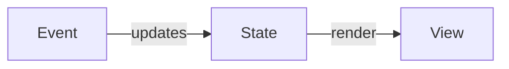

# Week 6 Review

# Client Side Technology
- Web Browser and the languages that are used in the browser
  - HTML
    - Content and structure 
  - CSS 
    - Style
  - JavaScript
    - Logic/ dynamic interation
- Web Browswer has three main components
  - HTML/CSS Renderer
  - JavaScript Engine
  - HTTP Client for making HTTP requests

## HTML
- HyperText Markup Language
- Defines the layout and content of a web page
- ***It is not a programming language***
  - You cannot do any *logic* with HTML
### HTML Anatomy
- Tag/Element
  - Core Building Block of an HTML page
  - Opening and closing tag. The content goes in the middle
  - Elements can be nested. 
  - Should not overlap
  - Some tags are self closing 
- Attributes
  - Modifiers on an element 
  - Some that all elements have that attribute and others specific to an element
```HTML
    <!-- Elements/Tags are the core building block of an HTML page -->
    <p>Hello, welcome to a <b>sample</b> bit of text</p>

    <hr/><!-- self closing -->
    
    <!-- src is the attribute -->
```
- Bare Miminum HTML page elements
  - DOCTYPE
  - html 
    - Root Tag
  - head
    - Meta Information
  - body
    - content
    - 
## CSS
- Cascading Style Sheets
  - Main purpose is to make websites pretty
- **NOT A PROGRAMMING LANGUAGE**
  - Techinally turing complete but realistically not a programming language
- **Cascade Algorthim**
  - Multiple styles can affect the same element
  - The algorithm determines what ultimate styles are applied
  - *The most specific CSS wins*
- CSS Sytnax
  - **Selector**
    - Class
    - Tag
    - id
  - **Properties**
    - Key Value pairs that define some sort of styling/Aesthetic
```CSS
    p{color:red; background-color:green}/** Selects all p tags and makes the text color red and background color green */
    #cooltable{color:green}/** select by ID */
    .awesome{color:orange}/** select by class */
```

## JavaScript
- The most popular programming language in the world
  - JS is the only language that runs in a web browser
- Brendan Eich wrote JS in 9 days
  - JS has a lot of quirky features
  - JS was designed with *flexibility* in mind
- Java and JavaScript have almost NOTHING in common
- JavaScript's main purpose is to make web pages dynamic/interative


|Java|JavaScript|
|----|----------|
|OOP| Functional (multi-pardigmed)|
|Multi-threaded|Single threaded (Event Based)|
|Strongly Typed (won't implicitly change datatypes) | Loosely Typed|
|Statically Typed (you have to declare the type of variable)|Dynamically Typed|
|Back-end language (web server)|JS is for browsers (JS can run in other places JS everywhere philosophy)|
|Compiled|Interpreted|
|Automatic Memory Management|Automatic Memory Management|

## DOM
- **Document Object Model**
  - Tree of nodes that make up an HTML page

- JavaScripts original purpose was **DOM Manipulation**
  - Dynamically updating and editing the DOM
    - Adding nodes
    - Removing nodes
    - Editing the content within a node
    - ETC....



## EcmaScript 6 features
- ECMA is the organization in charge of the standard language spec that JS adheres to.
- ES6/ES2015 was a massive update to the JS lanugage
- Key Features
  - Async Await
  - Promises
  - JS Classes
  - let, const
  - enhanced object literals
  - Module JS import syntax
  - template literals
  - arrow notation
  - Destrucutring
  - Default Parameters

## JavaScript Syntax

### Primtive Types
- Primitives are still objects in JavaScript
- Undefined is the default value of everything in JS
```JavaScript
const name = "Adam"; // string
const age = 19; //number there is not int,float,double
const isTrainer = true; // boolean
const nothing = null;// null
const wat = undefined// undefined 
// symbol bigint newer datatypes that are rarely used
```

### Truthy Falsy
- JS has very aggressive type coercion
  - It will change your data types into other data types for comparisons
  - 
```JavaScript
// There are a handful of inherently false values
// values that are defined to be coerced into false 
console.log(Boolean("")); // empty string
console.log(Boolean(0));  // zero
console.log(Boolean(-0));
console.log(Boolean(false));// false
console.log(Boolean(null));
console.log(Boolean(undefined));
console.log(Boolean(NaN));

// == vs ===
// == will do type coercion
9 == "9" // true
// === will compare type and value
9 === "9" // false
```

### Scopes
- Scopes are defined via keywords in front of a variable
- Block
  - let, const
- function
  - var
- global
  - nothing
```JavaScript
function intro(){
    if(true){
        let introduction = "Welcome to my program"; // the variable is confined the the curly brackets it was defined in
    }    
    console.log(introduction); // not defined
}
```

#### Hoisting
- Feature of var variables that there memory is allocated before the function exeuctes
```JavaScript
function hoist(){
    console.log(x);// undefined
    var x = 100; // var varibles are assigned the default value of undefined BEFORE the function actualy executes
}
hoist()
```

### Object Literals
- Objects are just key value pairs called properties
- They do not have to be created from a class
- Their properties are are always mutable 
```JavaScript
const adam = {fname:"Adam", lname:"Ranieri"}
```

### Functions
- JS is a functional language first
- Functions are first class citizens/objects
  - Functions ARE objects.
  - They can be stored in variables, passed as parameters just like any object

```JavaScript
function hello(){
    console.log("Hello");
}
// arrow functions have extra succinct syntax
// If the arrow function takes in 1 parameter you can omit the parentheses
const bonjour = nom =>{
    console.log("Bonjour " + nom);
}
// function isEven(number){
//     return number%2 === 0;
// }
// identical to
const isEven = number => number%2 === 0;
```
- ***Callback Functions***
  - Functions passed as parameters to other functions
```JavaScript
// func is the callback function
function doTwice(func){
    func();
    func();
}

const oddNums = nums.filter(num => num%2 === 1);

holaButton.addEventListener("click", hola);
```

### Arrays
- Arrays can hold any type
- Dynamically resize
```JavaScript
    const ray = []
```

### Template Literals
- Succinct syntax for string interpolation
```JavaScript
    const name = "Adam";
    console.log(`hello my name is ${name}`)
```

### Async Await
- A syntax for writing asynchonously executing code
- **Promise**
  - An empty object that will eventually have a value
    - pending
    - resolved
    - rejected
  - Many functions return promises to avoid clogging the event queue
    - You must await a promise for it to become a real value in your code
    - You can only use await in function that are labelled async
    - Any return from an async function is automatically wrapped in a promise
```JavaScript
    async function getSomethingFromServer(event){
        const httpResponse = await fetch("http://someplace.com");
        const body = await httpResponse.text();
    }
```

## Event Driven
- JavaScript was designed as an Event Driven language
- Web Pages are essentially Event driven application
- An **Event** could be just about anything that occurs on a web page
  - Usually a user action
  - Examples
    - User clicks on a button
    - User mouses over a list item
    - Page finsished loading
- JavaScript was designed to *do something* in response to an event


## Event Loop
- Web Browser contains many different pieces
  - JS Machine (V8)
  - HTTP Client 
  - HTML/CSS Render
  - All these pieces exist independently from each other

- JS is a single threaded language
  - And it can only process one event/function at anytime
- Every time an Event occurs it goes into *Event Queue*
- Event Loop will read the event queue and feed events into the JS engine for processing
  - This loop is always running
  - It is continually checking to see what the next event to process is
  - Blocking this event queue freezing JS


## Asynchronous Programming
- Async programming is an optimization for **IO** Input Output operations
  - IO operations are anything involving communicating with resources/programs *outside* of the runtime environment
    - Communicating with your database
    - Reading and writing from a file
    - Making http requests and waiting for the response
- Realistically there is **NOTHING** you can do to speed them up
  - There is no way to program your http request to be processed faster

## Thinking Asynchronously
- Imagine you were setting up a party 
- There are a bunch of things that you have to do
  - Get Plates and Paper towels out (synchronous)
  - Get Drinks on the table (synchronous)
  - Order a Pizza (aynchronous)
  - Clean up the bathroom (synchronous)
  - Replace a broken light in the living room  (synchronous)
    - Pizza arrived and I get it set up in the living room (Resolved)
  - Start the TV for a football game (synchronous)
  - Put some beers the fridge (synchronous)