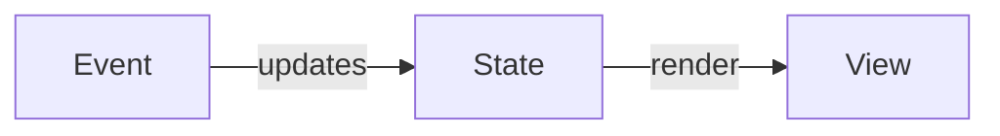
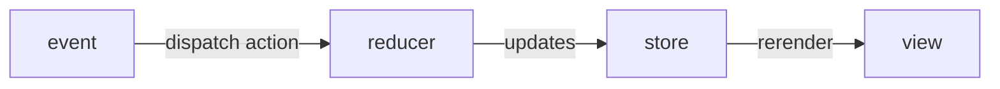

# Week 7
# React
- Front-end library developed by Facebook
  - Very open-ended and customizable
- ***SPA***
  - Single page application
    - An application that does not actually consist of many different html pages
    - All the HTML/CSS/JS is dynamically swapped out to give the *illusion* of pages

### React Philosphy
- ***Component Based***
  - A logical chunk of html/css/js for a portion of a web page
  - designed to be reuseable
  - Components can be nested
  - **Functional Components**
    - Newer Component style
    - Replaced class based components
    - return JSX
    - Take in **props** as parameters to the function
    - **props**
      - The values/dependenices passed into a functional component as the arguments
      - They are used in some way to help render the component
      - By convention the variable is called props
- ***JSX***
  - ***JavaScript eXtenstion***
  - HTML/CSS/JS are so intrinsically linked to each other on a web page that they **SHOULD** meld together
  - JSX is a extension of JavaScript that allows you to write HTML looking elements into your JS
    - ***JSX is JS*** it is not HTML
  - Your entire React application is 99% JavaScript
- ***Data flows down***
  - Data/state goes down the application
    - From the largest components to the smallest components
    - Data does *not* flow back up
  - **Container Components**
    - Components that have stateful values
    - Pass those values on to presentation components
  - **Presentation Components**
    - Components that are stateless
    - Lack the useState() hook
    - do not undergo updates. Rendered once
    - *dummy* components
  - Parent Component
    - a component that renders other components
  - Child Component
    - A component that is rendered by a parent

- Designing react Apps
  - Create your components using static content
    - JSX hardcoded html 
  - Write the *stateless* components and try to dynamically generate the content
    - Then make them accessible via props
  - Make the stateful componeents and pass down the values using props

### Component Lifecycle
1. intialization/mounting
   1. Component is created an rendered for the first time
2. Update
   1. Component is rerendered/update if necessary
3. Destruction/unmounting
   1. Component is removed from the DOM/screen

### Hooks
- Special functions that 'hook' into one of the lifecycle stages
- All hooks start with use by conventions
- You can only call hooks at the top level of a component
  - You cannot use it inside a function within the component
  - You cannot use it in the JSX

### useState
- creates a stateful value a for a component
  - A value that might change
  - That change would require the component to re-render
- useState()
  - returns an array 
    - 1st value readonly stateful variable
    - 2nd value setter function to **replace** that variable
- Tips
  - Never edit/change the readonly variable
  - setterFunction **Always** requires a new object
  - Never pass in the stateful variable to the setter function


### useEffect
- allows you to excute code at specific stages of the component lifecycle
```jsx

export default function page(){

    const [username,setUsername] = useState("");

    //component first loads
    useEffect(()=>{},[]);

    //component is destroyed
    useEffect(()=>{
        return () =>{/**code to execute when the component unmounts */}
    })

    //an update occurs on stateful value
    useEffect(()=>{
        // everytime username changes this useEffect executes
    },[username])

    //execute when first loading and anytime a stateful value changes
    useEffect(()=>{})

    return(<>
    </>)
}
```

## Redux
- State managagement library/tool for React
  - DOES NOT replace useState
  - Optional tool 
  - useful for when state is shared/updated across several sibling componenets
    - passing data directly to sibling compoments is NOT possible

- Key Terms
- Event
  - Something that happens
- **dispatch**
  - Special function that sends actions to a reducer
- **action**
  - an object holding information
    - type
    - payload
- **reducer**
  - a function that uses an action to update the store
- **store**
  - An object that holds state information used in several components

```JSX

export default function ATM(){

    const balance = useSelector(s => s.balance);// used to get a readonly value from your state
    const dispatch = useDispatch();// returns a function that can send action objects to a reducer 
}


```




## Axios
- HTTP Client library
  - Built on top of fetch
- Has slightly different methods from fetch that are cleaner looking

## WebPack
- HTML/CSS/JS bundler
  - take all the html/css/jsx and create useable minified files to be put on a web broswer
- **minification**
  - Taking source code and rewriting it to take the least amount of characters as possible
    - Reduces how large the files are
    - users can download them faster